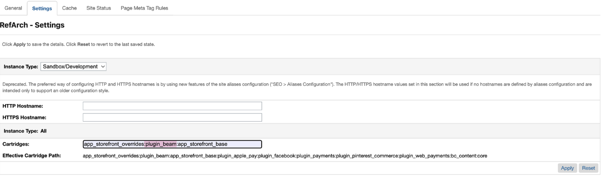
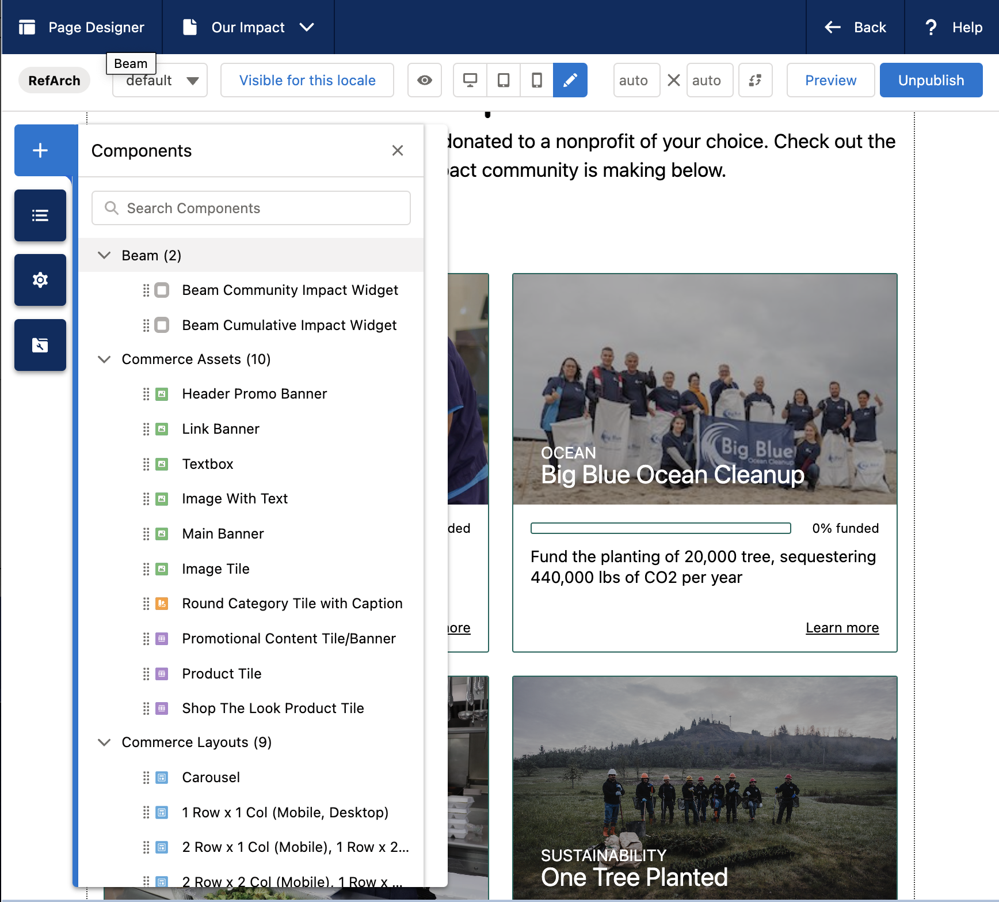

# Storefront Reference Architecture (SFRA)

This is a repository for the Storefront Reference Architecture reference application.

Storefront Reference Architecture has a base cartridge (`app_storefront_base`) provided by Commerce Cloud that is never directly customized or edited. Instead, customization cartridges are layered on top of the base cartridge. This change is intended to allow for easier adoption of new features and bug fixes.
Storefront Reference Architecture supplies an [plugin_applepay](https://github.com/SalesforceCommerceCloud/plugin-applepay) plugin cartridge to demonstrate how to layer customizations for the reference application.

Your feedback on the ease-of-use and limitations of this new architecture is invaluable during the developer preview. Particularly, feedback on any issues you encounter or workarounds you develop for efficiently customizing the base cartridge without editing it directly.

# The latest version

The latest version of SFRA is 6.3.0

# Beam Setup Instructions

1. Generate an access key for your user in [B2C Account Manager](https://zyoi-001.dx.commercecloud.salesforce.com/on/demandware.store/Sites-Site/default/ViewAccount-Show) by clicking the user avatar at the top right, choosing "Manage Access Keys" and generate a `WebDAV File Access and UX Studio` scoped key.

2. If you don't have NVM or some other Node version manager, that'd be highly recommended to install. This repository works well with Node `v12.22.12`, but does not work with `v18` and is untested in other versions. `nvm install v12.22.12` will install the Node version used to generate the initial B2C cartridges.

3. Run `cp dw.json.example dw.json`, change the username in `dw.json` to your Beam email (or the email you use for Account Manager), add your access key from step #1 as `password`, and leave `version` as "1" for now.

# Getting Started

1. Clone this repository.

2. Run `npm install` to install all of the local dependencies (SFRA has been tested with v12.21.0 and is recommended)

3. Run `npm run compile:js` from the command line that would compile all client-side JS files. Run `npm run compile:scss` and `npm run compile:fonts` that would do the same for css and fonts.

4. Create `dw.json` file in the root of the project. Providing a [WebDAV access key from BM](https://documentation.b2c.commercecloud.salesforce.com/DOC1/index.jsp?topic=%2Fcom.demandware.dochelp%2Fcontent%2Fb2c_commerce%2Ftopics%2Fadmin%2Fb2c_access_keys_for_business_manager.html) in the `password` field is optional, as you will be prompted if it is not provided.

```json
{
    "hostname": "your-sandbox-hostname.demandware.net",
    "username": "AM username like me.myself@company.com",
    "password": "your_webdav_access_key",
    "code-version": "version_to_upload_to"
}
```

5. Run `npm run uploadCartridge`. It will upload `app_storefront_base`, `modules` and `bm_app_storefront_base` cartridges to the sandbox you specified in `dw.json` file.

6. Use https://github.com/SalesforceCommerceCloud/storefrontdata to zip and import site data on your sandbox.

7. Add the `app_storefront_base` cartridge to your cartridge path in _Administration > Sites > Manage Sites > RefArch - Settings_ (Note: This should already be populated by the sample data in Step 6).

8. You should now be ready to navigate to and use your site.

# NPM scripts

Use the provided NPM scripts to compile and upload changes to your Sandbox.

## Compiling your application

-   `npm run compile:scss` - Compiles all .scss files into CSS.
-   `npm run compile:js` - Compiles all .js files and aggregates them.
-   `npm run compile:fonts` - Copies all needed font files. Usually, this only has to be run once.

If you are having an issue compiling scss files, try running 'npm rebuild node-sass' from within your local repo.

## Linting your code

`npm run lint` - Execute linting for all JavaScript and SCSS files in the project. You should run this command before committing your code.

## Watching for changes and uploading

`npm run watch` - Watches everything and recompiles (if necessary) and uploads to the sandbox. Requires a valid `dw.json` file at the root that is configured for the sandbox to upload.

## Uploading

`npm run uploadCartridge` - Will upload `app_storefront_base`, `modules` and `bm_app_storefront_base` to the server. Requires a valid `dw.json` file at the root that is configured for the sandbox to upload.

`npm run upload <filepath>` - Will upload a given file to the server. Requires a valid `dw.json` file.

# Testing

## Running unit tests

You can run `npm test` to execute all unit tests in the project. Run `npm run cover` to get coverage information. Coverage will be available in `coverage` folder under root directory.

-   UNIT test code coverage:

1. Open a terminal and navigate to the root directory of the mfsg repository.
2. Enter the command: `npm run cover`.
3. Examine the report that is generated. For example: `Writing coverage reports at [/Users/yourusername/SCC/sfra/coverage]`
4. Navigate to this directory on your local machine, open up the index.html file. This file contains a detailed report.

## Running integration tests

Integration tests are located in the `storefront-reference-architecture/test/integration` directory.

To run integration tests you can use the following command:

```
npm run test:integration
```

**Note:** Please note that short form of this command will try to locate URL of your sandbox by reading `dw.json` file in the root directory of your project. If you don't have `dw.json` file, integration tests will fail.
sample `dw.json` file (this file needs to be in the root of your project)
{
"hostname": "devxx-sitegenesis-dw.demandware.net"
}

You can also supply URL of the sandbox on the command line:

```
npm run test:integration -- --baseUrl devxx-sitegenesis-dw.demandware.net
```

# [Contributing to SFRA](./CONTRIBUTING.md)

# Page Designer Components for Storefront Reference Architecture

See: [Page Designer Components](./page-designer-components.md)

# How to Integrate Beam Widgets in **SFRA cartridge:**

## Set Up:

### Download `plugin_beam` Cartridge

1. Navigate to the following [Github Repo](https://github.com/Beam-Impact/beam-b2c-sfra)
2. Download the `plugin_beam` folder and add it to your `/cartridges` folder
3. Run the following commands in the `plugin_beam` directory:
    ```bash
    npm install
    npm run build
    ```
4. Update the `uploadCartridge` script in `package.json`:
    ```json
    "uploadCartridge": "... && sgmf-scripts --uploadCartridge plugin_beam && sgmf-scripts --uploadCartridge app_storefront_overrides",
    ```
5. Navigate to Administration > Sites > Manage Sites > RefArch - Settings
6. Under cartridges, add `plugin_beam` before the override cartridge.

### Installation and Build

1. Open a terminal and navigate to the `plugin_beam` directory
2. Run the following commands:
    ```bash
    npm install
    npm run build
    ```

### Update `package.json` Scripts

1. Open your `package.json` file
2. Find the `uploadCartridge` script and update it to include the new Cartridge. Add the following command:
    ```json
    "uploadCartridge": "... && sgmf-scripts --uploadCartridge plugin_beam && sgmf-scripts --uploadCartridge app_storefront_overrides",
    ```

### Configure Cartridge Order

1. Navigate to Administration > Sites > Manage Sites > RefArch - Settings
2. Under cartridges, add `plugin_beam` before the override cartridge in the specified configuration.
   

## Configure

### Metadata

Metadata files contain information about the structure, formatting, and characteristics of the associated data. The `beam_configuration.xml` holds credentials for the Beam widgets.

### Step 1: Downloading `beam_configuration.xml`

1. After downloading the `plugin_beam` cartridge source, navigate to the `metadata` > `meta` folder in the following [Github Repo](https://github.com/Beam-Impact/beam-b2c-sfra)
2. Download `beam_configuration.xml`

### Step 2: Uploading `beam_configuration.xml`

1. Go to Administration > Site Development > Import & Export
2. Click on the Upload button
3. Choose the file option and select `beam_configuration.xml`
4. Click Upload
5. Return to the Import & Export page
6. Select Import under Meta Data
7. Choose `beam_configuration.xml`
8. Click Next
9. Once the file is validated, select Import

### Step 3: Configuring Beam Credentials

1. Navigate to Merchant Tools > Site Preferences > Custom Preferences
2. Select Beam Credentials
3. Paste the credentials provided by Beam into the respective fields:
    - Store ID
    - Language
    - Chain ID
    - API Key
    - Base URL
    - Statsig API Key (optional)
    - Domain URL (optional)

## 3. Integration

### Beam Global Configuration

1. Open the htmlHead template file `cartridge/templates/default/common/htmlHead.isml`
2. Include the `beam/beam_init` before the `htmlHead` hook in the file. Add the following line:
    ```jsx
    <isinclude template="beam/beam_init" />
    ```

### Select Nonprofit Widget

1. Open the cart template file **`cartridge/templates/default/cart/cart.isml`**
2. Include the **`beam/beam_select_nonprofit`** where you see fit in the file. Add the following line:

    ```jsx
    <isinclude template="beam/beam_select_nonprofit" />
    ```

### Post-Purchase Widget

1.  Open the confirmationDetails template file **cartridge/templates/default/checkout/confirmation/confirmationDetails.isml**
2.  Include the **`beam/beam_post_purchase`** where you see fit in the file. Add the following line:

    ```jsx
    <isinclude template="beam/beam_post_purchase" />
    ```

### Community & Cumulative Impact Widget

### - Method 1: Page Designer

Page Designer allows Merchandising and Marketing teams to take charge of updates independently, eliminating the need for ongoing developer involvement. This autonomy not only minimizes overhead but also accelerates time-to-market for new online experiences, ensuring a high standard of quality. Page Designer in Salesforce B2C is typically used for designing and managing static pages. Hence the available widgets being the 'Community Impact' and 'Cumulative Impact' widgets.

#### How to Use Page Designer for Static Widgets:

1. **Navigate to Page Designer:**
    - Go to [Merchant Tools > Content > Page Designer]
2. **Select Your Page:**
    - Choose the static page where you want to add the widgets
3. **Select Components, Under Beam, Select A Widget:**
    - Look for the 'Beam' section and select 'Community Impact' or/and 'Cumulative Impact'
4. **Drag and Drop:**

    - Simply drag your selected widget onto the page
      </br>
      

5. **Add a Textbox Component Above the Community Impact Widget That States:**

    ```jsx
    <h3>The [INSERT NAME HERE]'s Impact</h3>
    <p>
        1% of every [INSERT NAME HERE] purchase is donated to a nonprofit of
        your choice. Check out the impact the [INSERT NAME HERE] community is
        making below.
    </p>
    ```

### - Method 2: Content Assets

1. **How to find assets list → Merchant Tools →  Content →  Content**
2. **Find the page you’d like to add the widgets to**
3. **Click ‘Lock’ under the page header**
4. **Navigate to body and add the following:**

    ```jsx
    <script type="module" src="https://production-beam-widgets.beamimpact.com/web-sdk/v1.30.0/dist/components/community-impact.esm.js"></script>
    <script type="module" src="https://production-beam-widgets.beamimpact.com/web-sdk/v1.30.0/dist/components/cumulative-impact.esm.js"></script>

    /** Cumulative Impact Widget **/
    <beam-cumulative-impact
        apikey="API KEY"
        chainid="CHAIN ID"
        storeid="STORE ID"
        lang="en">
    </beam-cumulative-impact>

    /** Community Impact Widget **/
    <h3 style="text-align: center;font-family: inherit; font-weight: 500;">
        The [INSERT NAME HERE]'s Impact
    </h3>
    <p style="font-weight: 300;font-size: 16px;max-width: 640px; margin:5px auto 15px;text-align: center;">
        1% of every [INSERT NAME HERE] purchase is donated to a nonprofit of your choice.
        <br/> Check out the impact the [INSERT NAME HERE] community is making below.
    </p>
    <beam-community-impact
        apikey="API KEY"
        chainid="CHAIN ID"
        storeid="STORE ID"
        lang="en"
        >
    </beam-community-impact>
    ```

### - Method 3: Inline

1. Access the template in the desired location for widget placement and include the following lines:

    ```jsx
    /** Cumulative Impact Widget **/
    <isinclude template="beam/beam_cumulative_impact"/>

    /** Community Impact Widget **/
    <h3>The [INSERT NAME HERE]'s Impact</h3>
    <p>1% of every [INSERT NAME HERE] purchase is donated to a nonprofit of your choice.
    Check out the impact the [INSERT NAME HERE] community is making below.</p>
    <isinclude template="beam/beam_community_impact"/>
    ```
