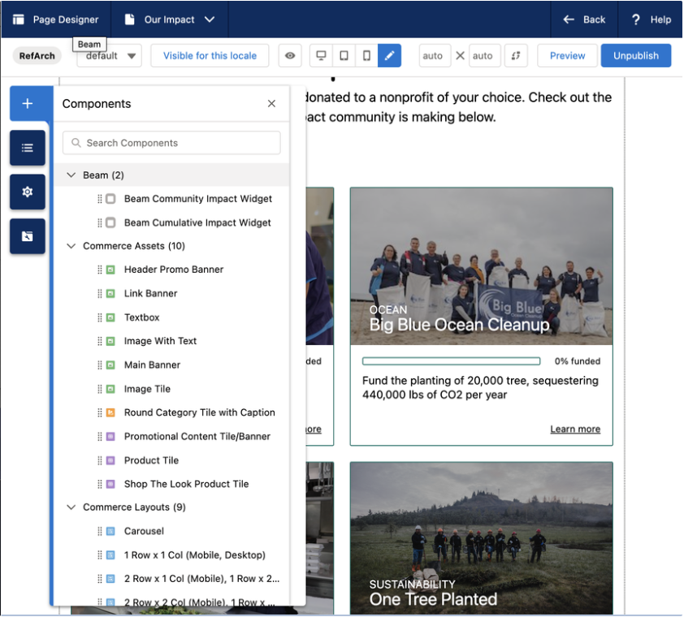

# Beam Salesforce Commerce Cloud (Demandware) Cartridge

Beam provides a cartridge to integrate with Salesforce Commerce Cloud (SFCC). This cartridge enables a SFCC storefront to use the Beam Impact widgets.

**Table of Contents**

- [Beam Salesforce Commerce Cloud (Demandware) Cartridge](#beam-salesforce-commerce-cloud-demandware-cartridge)
    - [Beam Setup](#beam-setup)
        - [1. Install `plugin_beam` Cartridge](#1-install-plugin_beam-cartridge)
        - [2. Import Beam Configuration File](#2-import-beam-configuration-file)
        - [3. Configure Beam Credentials](#3-configure-beam-credentials)
    - [Adding Beam to a Storefront](#adding-beam-to-a-storefront)
        - [Beam Global Configuration](#beam-global-configuration)
        - [Select Nonprofit Widget](#select-nonprofit-widget)
        - [Post-Purchase Widget](#post-purchase-widget)
        - [Community & Cumulative Impact Widgets](#community--cumulative-impact-widgets)
            - [Method 1: Page Designer](#method-1-page-designer)
                - [How to Use Page Designer for Static Widgets:](#how-to-use-page-designer-for-static-widgets)
            - [Method 2: Include ISML template](#method-2-include-isml-template)
            - [Method 3: Content Assets](#method-3-content-assets)

## Beam Setup

Cartridge structure:

- `app_storefront_base` The Salesforce Reference Architecture base cartridge. Your app should have a copy of this already.
- `app_storefront_overrides` Example cartridge for a customized storefront.
- `plugin_beam` Contains template files for including in customized storefronts.

Other:

- `metadata` Includes XML files defining configuration variables for Beam.

### 1. Install `plugin_beam` Cartridge

1. Download the [**`cartridges/plugin_beam`**](./cartridges/plugin_beam) folder and add it to the **`/cartridges`** folder in your storefront codebase
2. Add the Beam cartridge to the **`uploadCartridge`** script in your storefront's **`package.json`**:
    ```json
    "uploadCartridge": "... && sgmf-scripts --uploadCartridge plugin_beam",
    ```
3. Run the `uploadCartridge` script
4. Open your storefront's settings by navigating to _Administration → Sites → Manage Sites → RefArch → Settings_ (where _RefArch_ is your site name).
5. Under _Cartridges_, add **`plugin_beam`** to the right of your storefront's existing cartridge
   

### 2. Import Beam Configuration File

The **`beam_configuration.xml`** defines configuration settings for the Beam widgets which can be imported into your storefront.

1. Download [`metadata/beam_configuration.xml`](./metadata/beam_configuration.xml)
2. Go to Administration → Site Development → Import & Export
3. Click on the Upload button
4. Choose the file option and select **`beam_configuration.xml`**
5. Click Upload
6. Return to the Import & Export page
7. Select Import under Meta Data
8. Choose **`beam_configuration.xml`**
9. Click Next
10. Once the file is validated, select Import

### 3. Configure Beam Credentials

1. Navigate to Merchant Tools → Site Preferences → Custom Preferences
2. Select Beam Credentials
3. Paste the credentials provided by Beam into the respective fields:
    - Store ID
    - Language
    - Chain ID
    - API Key
    - Base URL
    - Statsig API Key (optional)
    - Domain URL (optional)

## Adding Beam to a Storefront

### Beam Global Configuration

Add Beam's global initialization code to the `head` of your storefront so it appears on every page.

1. Open the htmlHead template file [`cartridge/templates/default/common/htmlHead.isml`](./cartridges/app_storefront_overrides/cartridge/templates/default/common/htmlHead.isml)
2. To include this template, add the following line before the **`htmlHead`** hook:
    ```jsx
    <isinclude template="beam/beam_init" />
    ```

### Select Nonprofit Widget

1. Open your cart template file, e.g., **`cartridge/templates/default/cart/cart.isml`**
2. To include this template, add the following line:

    ```jsx
    <isinclude template="beam/beam_select_nonprofit" />
    ```

### Post-Purchase Widget

1.  Open the confirmationDetails template file. e.g., [`cartridge/templates/default/checkout/confirmation/confirmationDetails.isml`](./cartridges/app_storefront_overrides/cartridge/templates/default/checkout/confirmation/confirmationDetails.isml)
2.  To include this template, add the following line:

    ```jsx
    <isinclude template="beam/beam_post_purchase" />
    ```

### Community & Cumulative Impact Widgets

#### Method 1: Page Designer

Page Designer allows Merchandising and Marketing teams to take charge of updates independently, eliminating the need for ongoing developer involvement. This autonomy not only minimizes overhead but also accelerates time-to-market for new online experiences, ensuring a high standard of quality. Page Designer in Salesforce B2C is typically used for designing and managing static pages. Hence the available widgets being the 'Community Impact' and 'Cumulative Impact' widgets.

##### How to Use Page Designer for Static Widgets:

1. **Navigate to Page Designer:**
    - Go to [Merchant Tools → Content → Page Designer]
2. **Select Your Page:**
    - Choose the static page where you want to add the widgets
3. **Select Components, Under Beam, Select A Widget:**
    - Look for the 'Beam' section and select 'Community Impact' or/and 'Cumulative Impact'
4. **Drag and Drop:**
    - Simply drag your selected widget onto the page
      </br>
      
5. **Add a Textbox Component Above the Community Impact Widget That States:**

    ```jsx
    <h3>The [YOUR BRAND NAME HERE]'s Impact</h3>
    <p>
        1% of every [YOUR BRAND NAME HERE] purchase is donated to a nonprofit of
        your choice. Check out the impact the [YOUR BRAND NAME HERE] community is
        making below.
    </p>
    ```

#### Method 2: Include ISML template

1. Place the widget within your storefront code by including the following lines:

    ```jsx
    <!-- Cumulative Impact Widget -->
    <isinclude template="beam/beam_cumulative_impact"/>

    <!-- Community Impact Widget -->
    <h3>The [YOUR BRAND NAME HERE]'s Impact</h3>
    <p>1% of every [YOUR BRAND NAME HERE] purchase is donated to a nonprofit of your choice.
    Check out the impact the [YOUR BRAND NAME HERE] community is making below.</p>

    <isinclude template="beam/beam_community_impact"/>
    ```

#### Method 3: Content Assets

1. **How to find assets list: Merchant Tools →  Content →  Content**
2. **Find the page you’d like to add the widgets to**
3. **Click ‘Lock’ under the page header**
4. **Navigate to body and add the following:**

    ```jsx
    <script type="module" src="https://production-beam-widgets.beamimpact.com/web-sdk/v1.30.0/dist/components/community-impact.esm.js"></script>
    <script type="module" src="https://production-beam-widgets.beamimpact.com/web-sdk/v1.30.0/dist/components/cumulative-impact.esm.js"></script>

    <!-- Cumulative Impact Widget -->
    <beam-cumulative-impact
        apikey="API KEY"
        chainid="CHAIN ID"
        storeid="STORE ID"
        lang="en">
    </beam-cumulative-impact>

    <!-- Community Impact Widget -->
    <h3 style="text-align: center;font-family: inherit; font-weight: 500;">
        The [YOUR BRAND NAME HERE]'s Impact
    </h3>
    <p style="font-weight: 300;font-size: 16px;max-width: 640px; margin:5px auto 15px;text-align: center;">
        1% of every [YOUR BRAND NAME HERE] purchase is donated to a nonprofit of your choice.
        <br/> Check out the impact the [YOUR BRAND NAME HERE] community is making below.
    </p>
    <beam-community-impact
        apikey="API KEY"
        chainid="CHAIN ID"
        storeid="STORE ID"
        lang="en"
        >
    </beam-community-impact>
    ```

